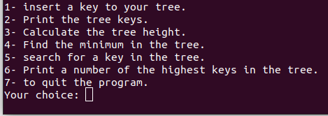

## Binary search tree
Binary Search Tree is a node-based binary tree data structure which has the following properties:
    *The left subtree of a node contains only nodes with keys lesser than the node’s key.
    *The right subtree of a node contains only nodes with keys greater than the node’s key.
    *The left and right subtree each must also be a binary search tree.

## About the program
Implemintation for binary search tree with example.



## Run the program
```
$ gcc main.c source.c -o main -lm -I.
$ ./main
```